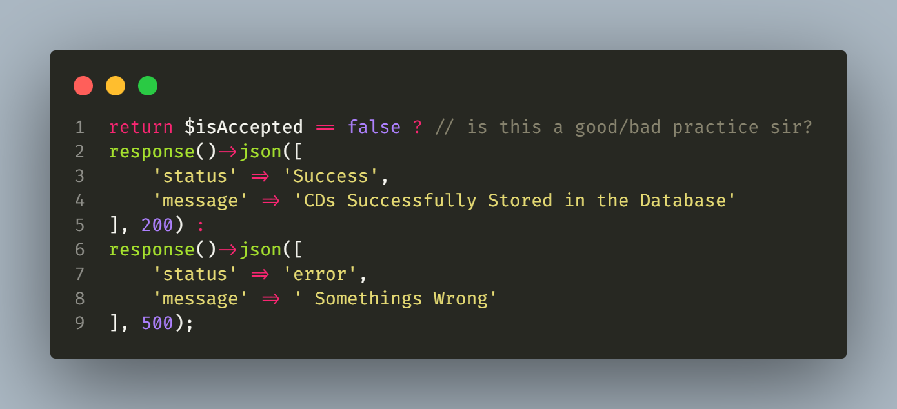
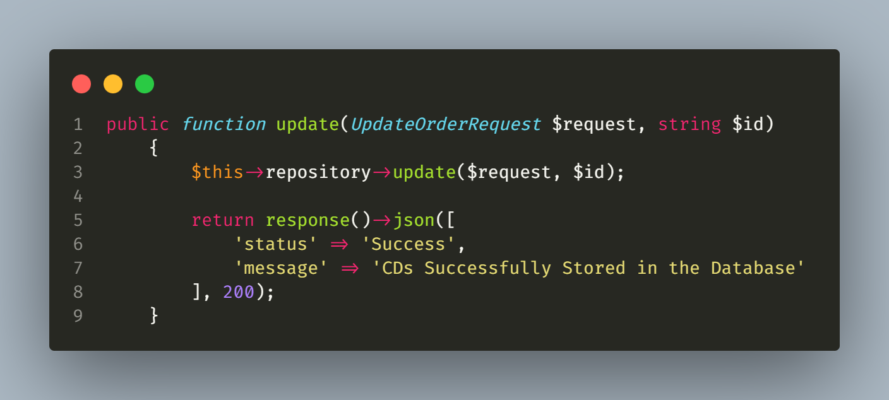

# BACKLOGS:
- Mail

# DONE:
- User Controller
- User Carts
- CDs List
- Order CDs
- StarWars Data Fetching

### I would like to ask if this is a good practice sir?
Thank you for looking my code sir!

Additional sir, medyo tumagal po ako sa PUT statement since di po makuha yung ID for some reason, but I used the ***string $id*** in order to get the ID from the Model

### - *Rap*